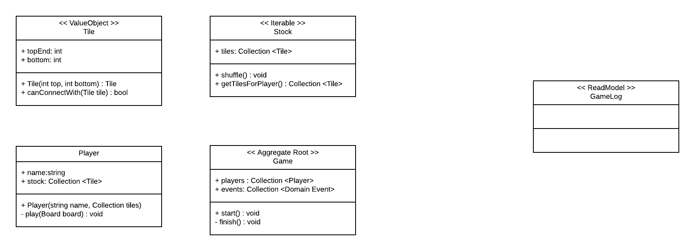

# domino-game
Coding assessment for eCurring

#### Install and Run
- `composer install` to install
- `vendor/bin/phpunit tests` to run the tests and see the result on CLI

### Class diagram

#### todo
- Update class diagram
    - Explain concepts used on solution
    - Model, View Model, Events, Low Coupling
- Update to use PHP 7.4