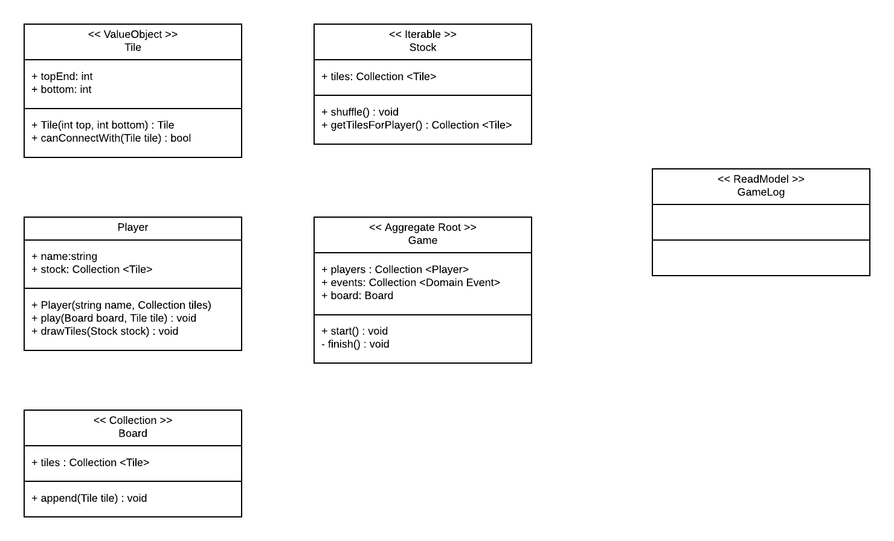
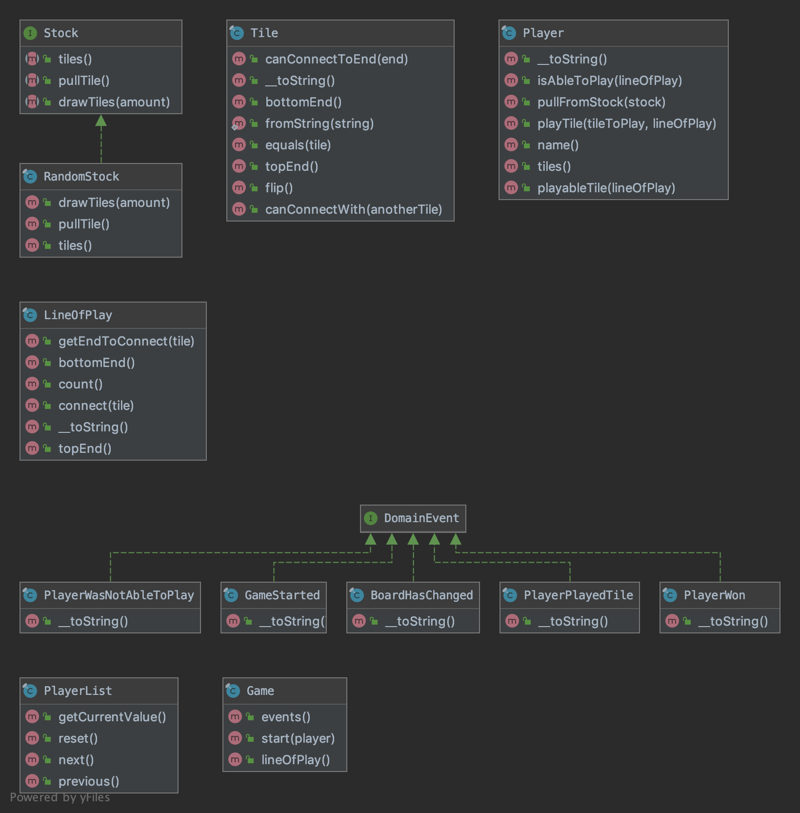

# domino-game
Coding assessment for eCurring

#### Install and Run
- `composer install` to install
- `php src/UserInterface/CLI/main.php` to execute the program
- `vendor/bin/phpunit tests` to run the tests

### Solution 
- Stock is an interface, so whenever I need to simulate and test a game play I can do it via implementing the stock Interface 
with a fixed list of Tiles
- Recursion + Circular Linked List was used to alternate between players. It'possible to add more players.
- Usage of Domain events was made in order to reduce the coupling between Domain logic and Console output. You can see it 
on the `main.php` file.

### Class diagram
##### Initial Idea

##### Final Result

#### Todo
- Create tests with just a few tiles on Stock
- What to do in case they run out of tiles on stock?
- Replace counts, etc... by collections
- Remove duplication on Stock classes
- Update to use PHP 7.4
- Drop Tile::canConnectWith and add tests on canConnectToEnd
- Drop unused methods (PlayerList)
